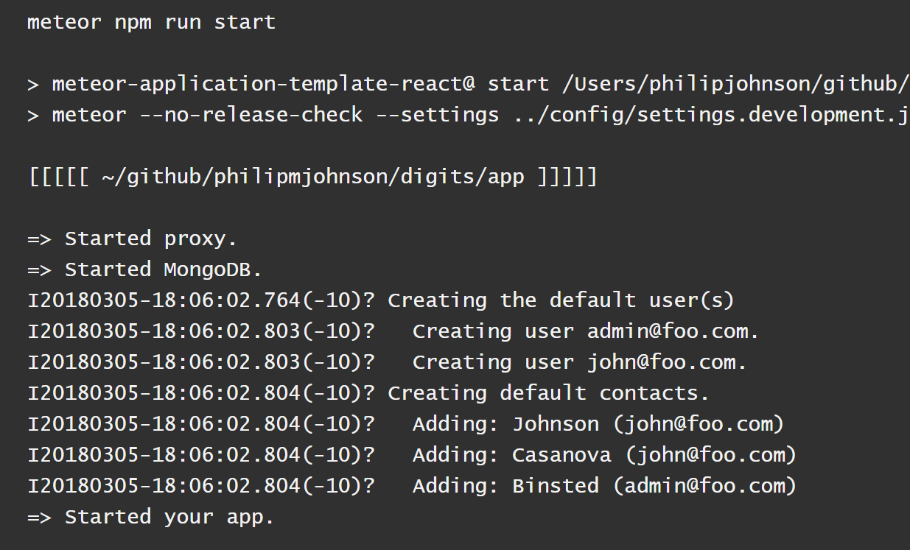

# **Digits**

Digits is an application that allows users to:

* Register an account.
* Create and manage a set of contacts.
* Add a set of timestamped notes regarding their interactions with each contact.

**Installation**
First, install Meteor.

Second, download a copy of [Digits](https://github.com/vjodar/digits)

Third, cd into the app directory install the required libraries with:

Once the libraries are installed, you can run the application by invoking:

The first time you run the app, it will create some default users and data. Here is the output:

## User Interface Walkthrough
### Landing Page
When you first bring up the application, you will see the landing page that provides a brief introduction to the capabilities of Digits:

### Register
If you do not yet have an account on the system, you can register by clicking on “Login”, then “Sign Up”:

### Sign in
Click on the Login link, then click on the Signin link to bring up the Sign In page which allows you to login:

### User home page
After successfully logging in, the system takes you to your home page. It is just like the landing page, but the NavBar contains links to list contact and add new contacts:

### List Contacts
Clicking on the List Contacts link brings up a page that lists all of the contacts associated with the logged in user:

### Edit Contacts
From the List Contacts page, the user can click the “Edit” link associated with any Contact to bring up a page that allows that Contact information to be edited:

### Admin mode
It is possible to designate one or more users as “Admins” through the settings file. When a user has the Admin role, they get access to a special NavBar link that retrieves a page listing all Contacts associated with all users:

